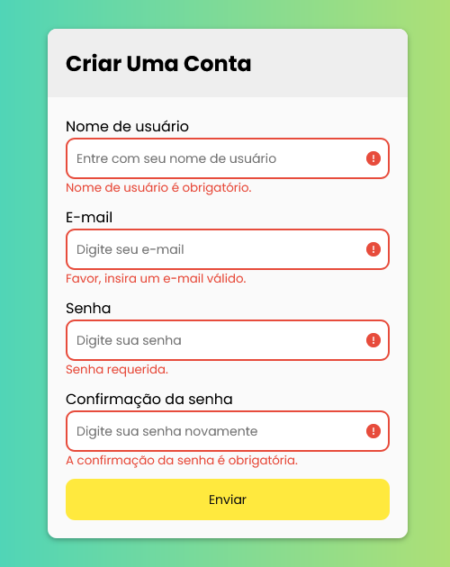

# Formulário com Validação em JavaScript

Este é um exemplo de como implementar um formulário com validação utilizando JavaScript. A validação é essencial para garantir que os dados inseridos pelos usuários sejam corretos antes do envio.

## Funcionalidades

- **Validação de Campos:** Verifica se os campos obrigatórios estão preenchidos e se os dados inseridos são válidos (ex: email válido).
- **Exibição de Mensagens de Erro:** Ao detectar um erro de validação, mensagens são exibidas abaixo dos campos correspondentes para orientar o usuário sobre como corrigir o problema.
- **Prevenção de Envio de Formulário:** O formulário não é enviado até que todos os campos estejam preenchidos corretamente.

## Como Usar

- Clone ou faça o download deste repositório.
- Abra o arquivo index.html em seu navegador.
- Experimente enviar o formulário com campos vazios ou dados inválidos para ver a validação em ação.

## Personalização

- Adicione mais campos ao formulário conforme necessário, garantindo que a validação seja ajustada para cada novo campo adicionado.

- Personalize as mensagens de erro e o estilo conforme o design da sua aplicação.

------------

**Formulário inicial**

------------

**Formulário erro**

------------

**Formulário válidado**

### Feito com :heart: por: Renato Brito
